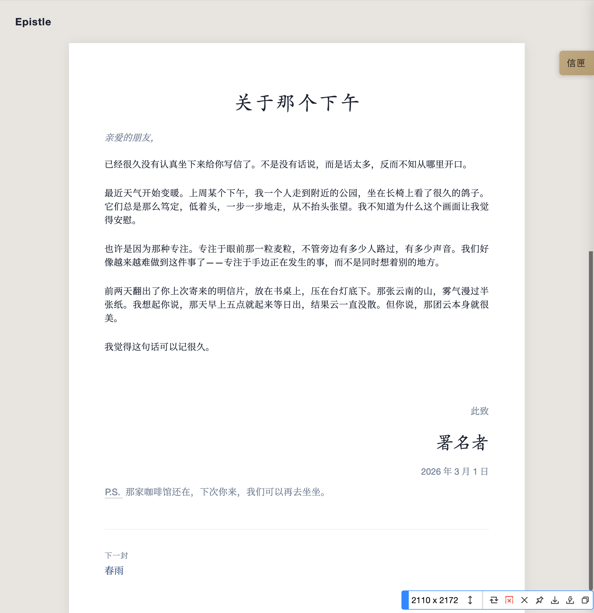

# Epistle · 尺素

> 一个以「私人书信」为设计隐喻的 Hugo 博客主题。


---

## 设计哲学

Epistle（尺素）将博客构想为**书桌上的一叠私人信札**：

- 首页是桌上摊开的最新一封信
- 点击「信匣」可展开历年书信归档
- 每篇文章都有称谓、正文、祝颂语、署名、日期——如传统中文书信

> "从前的日色变得慢，车、马、邮件都慢..."

---

## 预览



---

## 特性

| 特性 | 说明 |
|------|------|
| **书信隐喻** | 文章 = 信件，日期 = 落款，首页 = 桌上信笺 |
| **完整 Heti 支持** | 深度集成 [赫蹏 (Heti)](https://sivan.github.io/heti/)：自动中西文间距、标点挤压、行间注、诗词/古文/多栏排版等全部版式能力均通过 shortcode 开箱即用 |
| **五款信纸** | 白纸蓝墨 / 暖笺 / 晴空 / 夜信 / 春笺 |
| **楷体标题** | 文章标题使用楷体，营造手写感 |
| **信笺索引** | 右侧「信匣」按钮，抽屉式展开归档 |
| **轻量无依赖** | 纯原生 CSS/JS，无框架负担 |
| **社交预览** | 自动生成 Open Graph / Twitter Card 元标签，Telegram、微信、X 分享均显示标题、描述与封面图 |

---

## 安装

### 作为 Git Submodule

```bash
cd your-hugo-site
git init
git submodule add https://github.com/yibie/hugo-theme-epistle.git themes/epistle
```

然后在 `hugo.toml` 中设置主题：

```toml
theme = 'epistle'
```

### 本地开发链接

```bash
ln -s /path/to/hugo-theme-epistle /path/to/your-site/themes/epistle
```

---

## 配置

### 站点配置 (hugo.toml)

```toml
baseURL = 'https://example.com/'
languageCode = 'zh-CN'
title = '我的书信'
theme = 'epistle'

# 禁用分类和标签（主题不使用）
disableKinds = ["taxonomy", "term"]

# 摘要由 <!--more--> 控制
summaryLength = 0

[params]
  author = "作者名"                     # 用于署名
  description = "个人书信集"
  valediction = "此致"                  # 祝颂语（默认：此致）
  showSignature = true                  # 显示署名
  signatureImage = "/images/sig.png"    # 可选：手写签名图片
  ogImage = "https://example.com/images/og-default.jpg"  # 可选：社交分享默认封面图
```

### 文章 Front Matter

```yaml
---
title: "文章标题"
date: 2026-03-01T12:00:00+08:00
draft: false
letter_style: "warm"              # 可选：default | warm | sky | night | spring
salutation: "亲爱的朋友，"         # 可选：称谓
postscript: "又及：补充说明"       # 可选：P.S. 附言
image: "https://example.com/images/cover.jpg"  # 可选：本文社交预览封面图
---
```

---

## 社交预览（Open Graph / Telegram）

主题自动为每个页面生成完整的 Open Graph 与 Twitter Card 元标签，在 Telegram、微信、X（Twitter）等平台分享链接时显示标题、描述与封面图。

### 封面图设置

**全站默认封面图**（无单篇封面时使用）：

```toml
[params]
  ogImage = "https://example.com/images/og-default.jpg"
```

**单篇文章封面图**（在 front matter 中设置）：

```yaml
image: "https://example.com/images/cover.jpg"
```

图片建议尺寸 **1200×630px**，必须使用 HTTPS 绝对路径。

### 调试工具

- Telegram：向 [@WebpageBot](https://t.me/WebpageBot) 发送链接，可强制刷新预览缓存
- 通用：[Open Graph 调试器](https://www.opengraph.xyz/)

---

## 五款信纸主题

通过 `letter_style` 切换信纸风格：

| 主题值 | 名称 | 氛围 |
|--------|------|------|
| `default` | 白纸蓝墨 | 清爽正式，钢笔蓝 |
| `warm` | 暖笺 | 象牙纸，暖灯，深褐墨 |
| `sky` | 晴空 | 航空信纸蓝，远方思念 |
| `night` | 夜信 | 深夜告白，烛光氛围 |
| `spring` | 春笺 | 淡绿，自然，散文随笔 |

---

## Heti 排版增强

主题深度集成 [赫蹏 Heti](https://sivan.github.io/heti/)，以下能力**自动生效**，无需任何标记：

- 中西文混排自动插入 ¼ 字宽间距
- 连续标点自动挤压
- 文字贴合基线网格对齐

### Shortcodes

**诗词块** — 居中排版，含标题与落款：

```markdown

床前明月光，疑是地上霜。

```

**古文块** — 首行缩进的文言文段落：

```markdown

庆历四年春，滕子京谪守巴陵郡……

```

**行间注** — 为典故或难字加释义注（非注音）：

```markdown

<p>臣本<ruby>布衣<rp>（</rp><rt>平民百姓</rt><rp>）</rp></ruby>，躬耕于南阳。</p>

```

**行内行间注**：

```markdown
「」
```

**多栏排版**：

```markdown

左栏内容

右栏内容

```

**元信息**（来源、出处）：

```markdown
> 花自飘零水自流。[宋]李清照
```

**标点悬挂**（诗词末尾标点挂于行外）：

```markdown
独在异乡为异客，
```

---


```
hugo-theme-epistle/
├── archetypes/
│   └── default.md              # 文章模板
├── assets/
│   ├── css/main.css            # 源样式
│   └── js/main.js              # 源脚本
├── layouts/
│   ├── _default/
│   │   ├── baseof.html         # 基础模板
│   │   ├── list.html           # 首页：最新信件
│   │   └── single.html         # 单篇文章
│   └── partials/
│       ├── head.html
│       ├── header.html
│       ├── footer.html
│       └── sidebar.html        # 信匣归档
├── static/
│   ├── css/main.css
│   └── js/main.js
└── theme.toml
```

---

## 本地开发

```bash
# 链接到测试站点
cd your-hugo-site
git submodule add https://github.com/yibie/hugo-theme-epistle.git themes/epistle

# 启动开发服务器
hugo server -D

# 构建站点
hugo --minify
```

---

## 致谢

- [赫蹏 Heti](https://sivan.github.io/heti/) — 中文排版增强
- [Hugo](https://gohugo.io/) — 静态站点生成器

---

## 许可证

[GPL-3.0](https://www.gnu.org/licenses/gpl-3.0.html)

---

> "纸短情长，不尽依依。"
